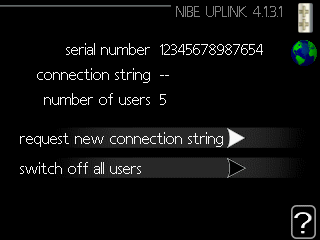
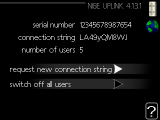

# nibe-exporter

A NIBE heat pump exporter for Prometheus.

## What do you need

You will need an account to [NIBE uplink](https://www.nibeuplink.com/).
Once the NIBE heat pump is connected to the network, you will have to
[connected](https://www.nibeuplink.com/Systems/Connect) to NIBE uplink.

To be able to connect the heat pump you will need its serial number and a connection string:

1. The serial number and the connection string can be found in menu `4.1.3.1`,
   nibe uplink, on the main unit. If you go into that menu, the following
   screen is displayed.  
   
2. Select `request new connection string` and press `OK`. The main unit will
   now communicate with nibe uplink and confirm a connection string. When this
   has been done, the screen below is displayed.  
   
3. The identification numbers displayed on the screen can be used to identify
   the system in nibe uplink for 60 minutes, or until they have been used once.

## Secrets

Create a file `.env` that looks like this:

```shell
export NIBE_USERNAME='username@example.com'
export NIBE_PASSWORD='Ve3ryStr0ngPa$4w0rd!'
```

## How to use this

This script can be used as a standalone script or as a docker container.

1. Standalone script

```shell
git clone git@github.com:eana/nibe_exporter.git
cd nibe_exporter
pip install -r requirements.txt
NIBE_USERNAME='your username' NIBE_PASSWORD='your password' ./nibe_exporter.py
```

2. Docker

```shell
docker build -t nibe-exporter https://github.com/eana/nibe-exporter.git
docker run -it --name nibe_exporter --rm -v /path/to/.env:/nibe-exporter/.env nibe-exporter
```

```yaml
scrape_configs:
  - job_name: "nibe_exporter"
    static_configs:
      - targets: ["localhost:9877"]
```
